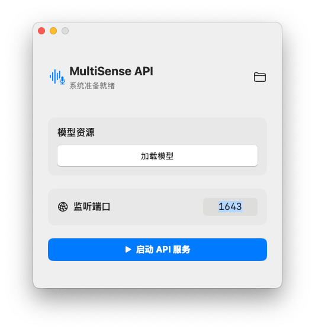

# MultiSense API

MultiSense API is a local audio and image recognition API service designed specifically for macOS, with extremely fast recognition speed.

All processing is done locally — no API key required, no internet connection needed, fully privacy-safe.

[[简体中文]](README.zh-CN.md) [[English]](README.md)

---

## Quick Start

1. **Load Model**: Click `Load Model` in the app interface. The software will automatically download the speech-to-text model. If you don't need speech-to-text functionality, you can skip this step.
2. **Start Service**: Set the listening port and click `Start API Service`.
3. **Status Check**: Confirm that each engine is ready by accessing the root path.

Base URL: `http://127.0.0.1:1643`



---

## Feature Readiness Check

Before calling specific endpoints, it is recommended to use this endpoint to check whether a particular feature is enabled or if the model has finished loading.

### `GET` **/**
Check the API service liveness status and internal component initialization.

#### Usage Example (JavaScript)
```JavaScript
const json = await fetch('http://localhost:1643').then(response => response.json())
console.log(json)
```

#### Response Properties
* **status** `string`
    Service running status. Returns `"success"` when operating normally.
* **transcribe** `boolean`
    **Speech transcription readiness**. If `false`, the ASR model has not been downloaded yet or is still loading. Calling `/transcribe` at this point will trigger automatic initialization.
* **ocr** `boolean`
    **Vision engine readiness**. Based on the macOS system framework, this is typically always `true`.
* **classify** `boolean`
    **Object classification engine readiness**. Based on the macOS system framework, this is typically always `true`.

> **Response Example**
> ```json
> {
>   "status": "success",
>   "transcribe": true,
>   "ocr": true,
>   "classify": true
> }
> ```

---

## API Reference

### Speech to Text
`POST` **/transcribe**

Converts an audio or video stream into text.

Supported languages: English, Spanish, French, Russian, German, Italian, Polish, Ukrainian, Romanian, Dutch, Hungarian, Greek, Swedish, Czech, Bulgarian, Portuguese, Slovak, Croatian, Danish, Finnish, Lithuanian, Slovenian, Latvian, Estonian, Maltese.

#### Request Parameters (Multipart/Form-Data)
| Parameter | Type | Status | Description |
| :--- | :--- | :--- | :--- |
| `audio` | `file` | <kbd>Required</kbd> | The binary audio stream to be transcribed. |

#### Usage Example (JavaScript)
```JavaScript
const blob = await fetch('https://example.com/demo.mp3').then(response => response.blob())

const formData = new FormData()
formData.append('audio', blob)
const json = await fetch('http://localhost:1643/transcribe', {
  method: 'POST',
  body: formData
}).then(response => response.json())

console.log(json.text)
```

> **Response Example**
> ```json
> {
>   "text": "Text content identified from audio."
> }
> ```

---

### Image Text Recognition
`POST` **/ocr**

Extracts multilingual text from an image.

<details>
<summary>Supported Languages</summary>

| Language Code | Language |
|:---:|:---:|
| en-US | English (United States) |
| fr-FR | French (France) |
| it-IT | Italian |
| de-DE | German |
| es-ES | Spanish |
| pt-BR | Portuguese (Brazil) |
| zh-Hans | Chinese (Simplified) |
| zh-Hant | Chinese (Traditional) |
| yue-Hans | Cantonese (Simplified) |
| yue-Hant | Cantonese (Traditional) |
| ko-KR | Korean |
| ja-JP | Japanese |
| ru-RU | Russian |
| uk-UA | Ukrainian |
| th-TH | Thai |
| vi-VT | Vietnamese |
| ar-SA | Arabic (Modern Standard Arabic) |
| ars-SA | Arabic (Najdi dialect, Saudi Arabia) |

</details>

#### Request Parameters (Multipart/Form-Data)
| Parameter | Type | Status | Description |
| :--- | :--- | :--- | :--- |
| `image` | `file` | <kbd>Required</kbd> | The image file to be processed. |
| `language` | `string` | <kbd>Optional</kbd> | Language code (e.g. `zh-Hans,en-US`). Defaults to Chinese-English bilingual. |
| `lineBreak` | `boolean` | <kbd>Optional</kbd> | Whether to preserve detected line breaks. Defaults to `true`. |

#### Usage Example (JavaScript)
```JavaScript
const blob = await fetch('https://example.com/demo.jpg').then(response => response.blob())

const formData = new FormData()
formData.append('image', blob)
formData.append('language', 'es-ES')
formData.append('lineBreak', false)
const json = await fetch('http://localhost:1643/ocr', {
  method: 'POST',
  body: formData
}).then(response => response.json())

console.log(json.text)
```

> **Response Example**
> ```json
> {
>   "text": "Text content identified from image."
> }
> ```

---

### Image Classification
`POST` **/classify**

Identifies objects and scenes in an image and returns confidence scores.

#### Request Parameters (Multipart/Form-Data)
| Parameter | Type | Status | Description |
| :--- | :--- | :--- | :--- |
| `image` | `file` | <kbd>Required</kbd> | The image to be classified. |

#### Usage Example (JavaScript)
```JavaScript
const blob = await fetch('https://example.com/demo.jpg').then(response => response.blob())

const formData = new FormData()
formData.append('image', blob)
const json = await fetch('http://localhost:1643/classify', {
  method: 'POST',
  body: formData
}).then(response => response.json())

console.log(json)
```

> **Response Example**
> ```json
> {
>   "labels": [
>     {
>       "identifier": "Laptop",
>       "confidence": 0.985
>     }
>   ]
> }
> ```
